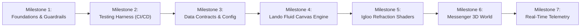

# OmniFlow Implementation Plan & Issue Tracker
### *Chronological Execution Checklist & Automated Harness Verification*

---

## 🚦 Harness & Verification Rules
Before checking off any task:
1. Run `npx tsc --noEmit` -> Must exit with code 0 (zero type errors).
2. Run `npx playwright test` -> Must pass all tests green.
3. Confirm no component file exceeds 150 lines.
4. Confirm zero hardcoded text strings in JSX.

---

## 📅 Chronological Milestone Roadmap

---

### 📦 Milestone 1: Foundation & Strict Compiler Guardrails
- [ ] Issue #CORE-01: Initialize Next.js 15 project with TypeScript in strict mode.
- [ ] Issue #CORE-02: Configure `tsconfig.json` (`strict: true`, `noImplicitAny: true`).
- [ ] Issue #CORE-03: Set up semantic design tokens in `tailwind.config.ts` (Obsidian canvas `#08090D`, Racing Lime `#d2ff00`, Frosted borders).
- [ ] Issue #CORE-04: Set up `src/` folder tree (`config`, `types`, `components`, `hooks`, `lib`, `app`).

---

### 📦 Milestone 2: The Self-Sustaining Harness (Playwright + GitHub CI)
- [ ] Issue #TEST-01: Install and configure `@playwright/test` with headless WebGL canvas mocking.
- [ ] Issue #TEST-02: Create `tests/e2e/smoke.spec.ts` (verifies clean DOM mount, no console errors).
- [ ] Issue #TEST-03: Create `.github/workflows/ci-cd.yml` (runs typecheck + Playwright on every PR).

---

### 📦 Milestone 3: The Data Contract Layer (Zero Hardcoding)
- [ ] Issue #DATA-01: Create `src/types/site.ts` with Zod validation schemas for all brand copy, typography parameters, shader values, and 3D planet landmarks.
- [ ] Issue #DATA-02: Create `src/config/site.ts` populated with default configuration.
- [ ] Issue #DATA-03: Export TypeScript types via `z.infer`.

---

### 📦 Milestone 4: Engine 1 — Lando Norris Fluid Canvas & Typography
- [ ] Issue #LANDO-01: Preload `Mona Sans` variable font in `src/app/layout.tsx`.
- [ ] Issue #LANDO-02: Implement the 1728px fluid rem scaling formula in `src/app/globals.css`.
- [ ] Issue #LANDO-03: Build `src/components/lando/FluidHero.tsx` and `KineticHeading.tsx` with F1 braking cubic-bezier easing.
- [ ] Issue #LANDO-04: Write E2E test `tests/e2e/typography.spec.ts`.

---

### 📦 Milestone 5: Engine 2 — Igloo Inc. Procedural Refraction & Shaders
- [ ] Issue #IGLOO-01: Install Three.js and `@react-three/fiber` with serverless-safe dynamic imports.
- [ ] Issue #IGLOO-02: Implement procedural glass/ice refraction shader in `src/lib/shaders/`.
- [ ] Issue #IGLOO-03: Build `RefractiveCapsule.tsx` with light dispersion.
- [ ] Issue #IGLOO-04: Build `SDFScrambleText.tsx` for GPU-accelerated character decode glitches on hover.
- [ ] Issue #IGLOO-05: Write E2E test `tests/e2e/shaders.spec.ts`.

---

### 📦 Milestone 6: Engine 3 — Messenger Spherical 3D World & Multiplayer
- [ ] Issue #MESSENGER-01: Build `SphericalCanvas.tsx` with spherical gravity vector math.
- [ ] Issue #MESSENGER-02: Implement low-poly terrain mesh with downward raycasting.
- [ ] Issue #MESSENGER-03: Implement lightweight multiplayer presence (mock or WebSocket sync) with avatar markers.
- [ ] Issue #MESSENGER-04: Write E2E test `tests/e2e/spherical-world.spec.ts`.

---

### 📦 Milestone 7: Real-Time Telemetry & Admin Desk
- [ ] Issue #OPS-01: Build `LiveTicker.tsx` streaming simulated/live order and visitor pulses.
- [ ] Issue #OPS-02: Build `AdminOverrideDesk.tsx` allowing zero-code live edits to copy, prices, and shader parameters.
- [ ] Issue #OPS-03: Connect MongoDB Atlas cached connection pool (`src/lib/db.ts`).
- [ ] Issue #OPS-04: Final production audit: `npx tsc --noEmit` and full E2E test run.
